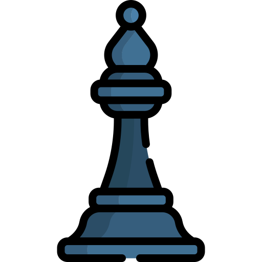

<h1 align="center">Hi , I'm Daniyar</h1>

## :sassy_man:  About me
- :school: I am a `Senior` at Grand Canyon University
- :technologist: I love using Software as a solution for every `Problem`
- :student: I’m currently learning: `Computer Programming` and `Software Engineering`.
- :thinking: I’m currently open for: `An Intern` or a new `job opportunity`, this is [MY RESUME](https://github.com/AbeuovDaniyar/AbeuovDaniyar/blob/master/Daniyar%20Abeuov%20Resume.pdf).
- :nerd_face: Always `learning new things`

 

      
      
      
      
       

 

## 🛠️ My Skills

### 👉 Programming languages

 
  &emsp; 
    
  &emsp;
    
  &emsp; 
    
  &emsp;
     
  &emsp;
    
  &emsp; 
    
  &emsp;
    

### 👉 Frameworks

 
  &emsp; 
   
  &emsp;
    
  &emsp;
    
  &emsp;
    
  &emsp;
    

 ### 👉 Software & Tools
 

  &emsp;
    
  &emsp;
    
  &emsp;
    
  &emsp;
    
  &emsp;
    
  &emsp;
    
  &emsp;
    
  &emsp;
    

 ### 👉 IDEs
 

  &emsp;
    
  &emsp;
    
  &emsp;
    

 

Would you like to play some chess?  
It's your turn to play! Move a <!-- BEGIN TURN -->black<!-- END TURN --> piece.

<!-- BEGIN CHESS BOARD -->
|   | A | B | C | D | E | F | G | H |   |
|---|:-:|:-:|:-:|:-:|:-:|:-:|:-:|:-:|:-:|
| **8** |  |  |  |  |  |  |  |  | **8** |
| **7** |  |  |  |  |  |  |  |  | **7** |
| **6** |  |  |  |  |  |  |  |  | **6** |
| **5** |  |  |  |  |  |  |  |  | **5** |
| **4** |  |  |  |  |  |  |  |  | **4** |
| **3** |  |  |  |  |  |  |  |  | **3** |
| **2** |  |  |  |  |  |  |  |  | **2** |
| **1** |  |  |  |  |  |  |  |  | **1** |
|   | **A** | **B** | **C** | **D** | **E** | **F** | **G** | **H** |   |
<!-- END CHESS BOARD -->

**It's your turn to move! Choose one from the following table**
<!-- BEGIN MOVES LIST -->
|  FROM  | TO (Just click a link!) |
| :----: | :---------------------- |
| **A7** | [A5](https://github.com/AbeuovDaniyar/AbeuovDaniyar/issues/new?body=Please+do+not+change+the+title.+Just+click+%22Submit+new+issue%22.+You+don%27t+need+to+do+anything+else+%3AD&title=Chess%3A+Move+A7+to+A5), [A6](https://github.com/AbeuovDaniyar/AbeuovDaniyar/issues/new?body=Please+do+not+change+the+title.+Just+click+%22Submit+new+issue%22.+You+don%27t+need+to+do+anything+else+%3AD&title=Chess%3A+Move+A7+to+A6) |
| **B7** | [B5](https://github.com/AbeuovDaniyar/AbeuovDaniyar/issues/new?body=Please+do+not+change+the+title.+Just+click+%22Submit+new+issue%22.+You+don%27t+need+to+do+anything+else+%3AD&title=Chess%3A+Move+B7+to+B5), [B6](https://github.com/AbeuovDaniyar/AbeuovDaniyar/issues/new?body=Please+do+not+change+the+title.+Just+click+%22Submit+new+issue%22.+You+don%27t+need+to+do+anything+else+%3AD&title=Chess%3A+Move+B7+to+B6) |
| **B8** | [A6](https://github.com/AbeuovDaniyar/AbeuovDaniyar/issues/new?body=Please+do+not+change+the+title.+Just+click+%22Submit+new+issue%22.+You+don%27t+need+to+do+anything+else+%3AD&title=Chess%3A+Move+B8+to+A6), [C6](https://github.com/AbeuovDaniyar/AbeuovDaniyar/issues/new?body=Please+do+not+change+the+title.+Just+click+%22Submit+new+issue%22.+You+don%27t+need+to+do+anything+else+%3AD&title=Chess%3A+Move+B8+to+C6) |
| **C7** | [C5](https://github.com/AbeuovDaniyar/AbeuovDaniyar/issues/new?body=Please+do+not+change+the+title.+Just+click+%22Submit+new+issue%22.+You+don%27t+need+to+do+anything+else+%3AD&title=Chess%3A+Move+C7+to+C5), [C6](https://github.com/AbeuovDaniyar/AbeuovDaniyar/issues/new?body=Please+do+not+change+the+title.+Just+click+%22Submit+new+issue%22.+You+don%27t+need+to+do+anything+else+%3AD&title=Chess%3A+Move+C7+to+C6) |
| **D7** | [D5](https://github.com/AbeuovDaniyar/AbeuovDaniyar/issues/new?body=Please+do+not+change+the+title.+Just+click+%22Submit+new+issue%22.+You+don%27t+need+to+do+anything+else+%3AD&title=Chess%3A+Move+D7+to+D5), [D6](https://github.com/AbeuovDaniyar/AbeuovDaniyar/issues/new?body=Please+do+not+change+the+title.+Just+click+%22Submit+new+issue%22.+You+don%27t+need+to+do+anything+else+%3AD&title=Chess%3A+Move+D7+to+D6) |
| **E7** | [E5](https://github.com/AbeuovDaniyar/AbeuovDaniyar/issues/new?body=Please+do+not+change+the+title.+Just+click+%22Submit+new+issue%22.+You+don%27t+need+to+do+anything+else+%3AD&title=Chess%3A+Move+E7+to+E5), [E6](https://github.com/AbeuovDaniyar/AbeuovDaniyar/issues/new?body=Please+do+not+change+the+title.+Just+click+%22Submit+new+issue%22.+You+don%27t+need+to+do+anything+else+%3AD&title=Chess%3A+Move+E7+to+E6) |
| **F7** | [F5](https://github.com/AbeuovDaniyar/AbeuovDaniyar/issues/new?body=Please+do+not+change+the+title.+Just+click+%22Submit+new+issue%22.+You+don%27t+need+to+do+anything+else+%3AD&title=Chess%3A+Move+F7+to+F5), [F6](https://github.com/AbeuovDaniyar/AbeuovDaniyar/issues/new?body=Please+do+not+change+the+title.+Just+click+%22Submit+new+issue%22.+You+don%27t+need+to+do+anything+else+%3AD&title=Chess%3A+Move+F7+to+F6) |
| **G7** | [G5](https://github.com/AbeuovDaniyar/AbeuovDaniyar/issues/new?body=Please+do+not+change+the+title.+Just+click+%22Submit+new+issue%22.+You+don%27t+need+to+do+anything+else+%3AD&title=Chess%3A+Move+G7+to+G5), [G6](https://github.com/AbeuovDaniyar/AbeuovDaniyar/issues/new?body=Please+do+not+change+the+title.+Just+click+%22Submit+new+issue%22.+You+don%27t+need+to+do+anything+else+%3AD&title=Chess%3A+Move+G7+to+G6) |
| **G8** | [F6](https://github.com/AbeuovDaniyar/AbeuovDaniyar/issues/new?body=Please+do+not+change+the+title.+Just+click+%22Submit+new+issue%22.+You+don%27t+need+to+do+anything+else+%3AD&title=Chess%3A+Move+G8+to+F6), [H6](https://github.com/AbeuovDaniyar/AbeuovDaniyar/issues/new?body=Please+do+not+change+the+title.+Just+click+%22Submit+new+issue%22.+You+don%27t+need+to+do+anything+else+%3AD&title=Chess%3A+Move+G8+to+H6) |
| **H7** | [H5](https://github.com/AbeuovDaniyar/AbeuovDaniyar/issues/new?body=Please+do+not+change+the+title.+Just+click+%22Submit+new+issue%22.+You+don%27t+need+to+do+anything+else+%3AD&title=Chess%3A+Move+H7+to+H5), [H6](https://github.com/AbeuovDaniyar/AbeuovDaniyar/issues/new?body=Please+do+not+change+the+title.+Just+click+%22Submit+new+issue%22.+You+don%27t+need+to+do+anything+else+%3AD&title=Chess%3A+Move+H7+to+H6) |
<!-- END MOVES LIST -->

#### How it works

When you click on a link and submit a new issue with the desired move, a GitHub action is triggered, which in turn runs a small python script that performs the specified movement, updates this README file and commits the changes.

  
Last 5 moves in this game

<!-- BEGIN LAST MOVES -->

| Move | Author |
| :--: | :----- |
| `D2` to `D4` | [ @AbeuovDaniyar](https://github.com/AbeuovDaniyar) |
| `Start game` | [ @AbeuovDaniyar](https://github.com/AbeuovDaniyar) |

<!-- END LAST MOVES -->

  
Top 10 most moves across all games

<!-- BEGIN TOP MOVES -->

| Total moves |  User  |
| :---------: | :----- |
| 1 | [@AbeuovDaniyar](https://github.com/AbeuovDaniyar) |

<!-- END TOP MOVES -->

---

Do you want to make your own? Check out [marcizhu/readme-chess](https://github.com/marcizhu/readme-chess)!
